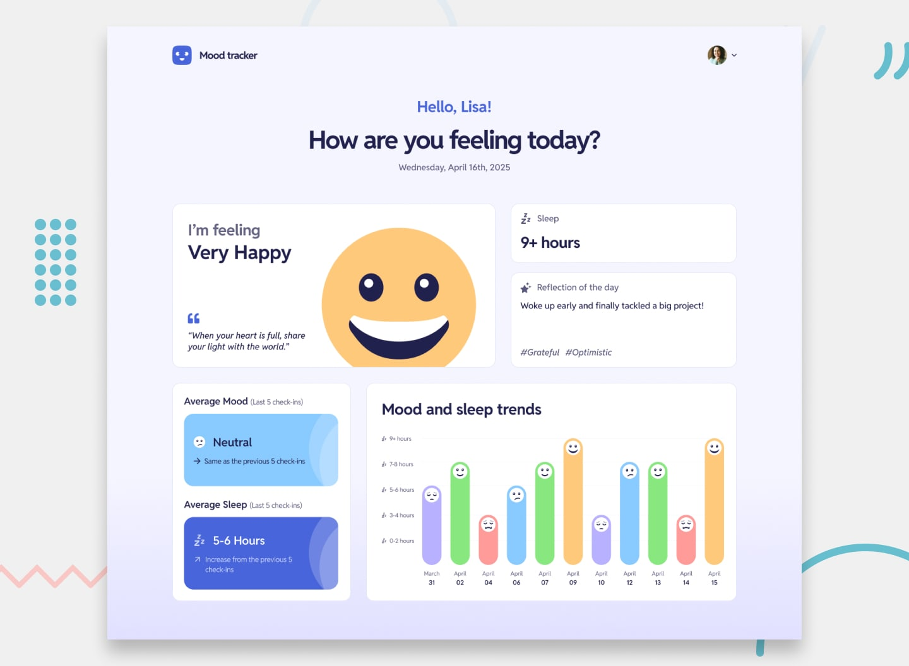

<h1 align="center"> Frontend Mentor - Mood Tracking App</h1>

This is a solution to the [Mood Tracking App challenge on Frontend Mentor](https://www.frontendmentor.io/challenges/mood-tracking-app-E2XeKhDF0B). Frontend Mentor challenges help you improve your coding skills by building realistic projects.

## Links

- [Solution](https://www.frontendmentor.io/solutions/mood-tracking-app-0e2KxzdEyM)
- [Live Site](http://mood-app-paladinescamila.netlify.app)

## Built with

- React.js
- TypeScript
- TailwindCSS
- Firebase

## What I learned

- I learned how to keep a four-step mood form predictable by storing its values in one typed object and validating each step before continuing.
- I solved the chart tooltip positioning problem by calculating whether the tooltip fits to the left, right, or center of each entry.
- I practiced handling Firebase authentication, Firestore data, and Storage uploads with explicit loading and failure states.
- I improved accessibility with semantic forms, native radio and checkbox controls, keyboard support, focus management, and screen-reader labels.

## Continue development

- Add component and end-to-end tests for authentication, onboarding, and mood-entry recovery flows.
- Add date filters and richer visualizations for longer-term mood and sleep trends.
- Add an account recovery flow and stronger form validation feedback.

## Author

- Website - [camilapaladines.netlify.app](https://camilapaladines.netlify.app)
- Frontend Mentor - [@paladinescamila](https://www.frontendmentor.io/profile/paladinescamila)
- LinkedIn - [@paladinescamila](https://co.linkedin.com/in/paladinescamila)
